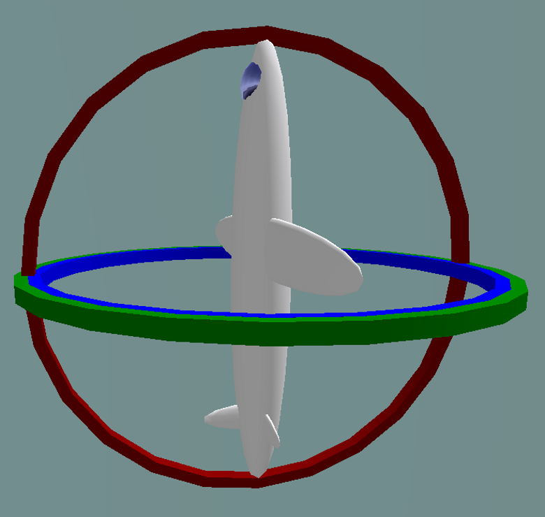
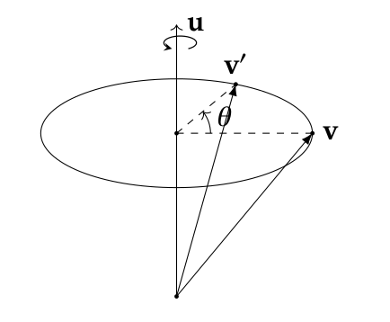
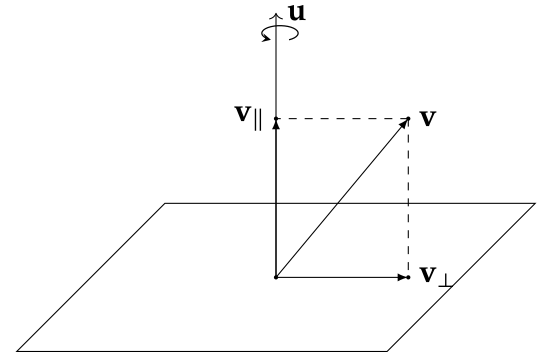
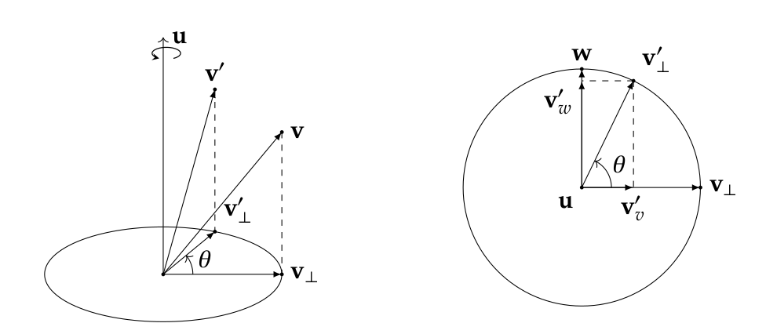
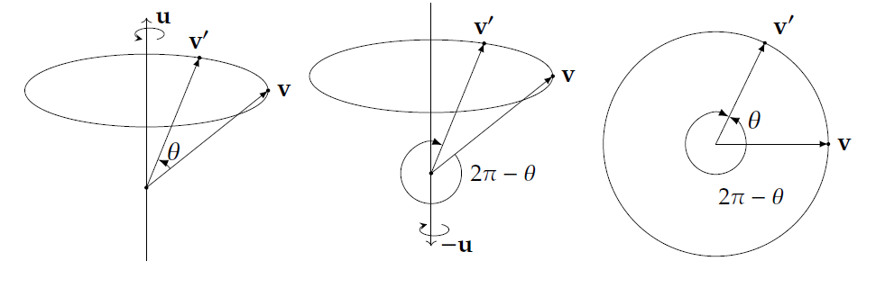
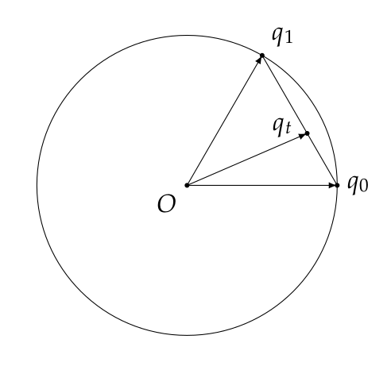
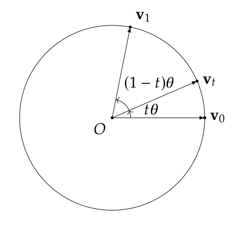

# SLAM数学基础

本博客主要介绍SLAM有关四元数。

> 作者： :point_right:**王广福**
>
> 联系方式： :e-mail:thuwgf@gmail.com
>
> 地址：:cn:北京
>
> Github主页：**:link:[GuangfuWang](https://guangfuwang.github.io/)**

## 目录

[toc]

***


## 四元数（Quaternion）

> 本节诸多内容参考了**[Krasjet](https://krasjet.com/)**的笔记，在此表示感谢，有兴趣的读者可以阅读**[原文](https://krasjet.com/rnd.wlk/)**。

### 四元数由来

​	在前述章节中，我们使用了欧拉角并且基于此应用旋转矩阵$R$来表示刚体运动中的旋转运动，旋转矩阵$R$属于特殊正交群$SO(3)$，关于群、特殊正交群的内容将在李群李代数章节中进行详细陈述，为便于理解四元数的由来，在此先对其进行简要的介绍，如果对群的内容不了解也没关系，可以先留下疑问。特殊正交群是李群的一种，正交群是指满足下式的可逆矩阵：
$$
O(n)=\lbrace Q \in GL(n,F)\mid QQ^T=Q^TQ=I\rbrace
$$
​	简单来说，正交群就是逆与转置相等、行列式绝对值等于1的方阵，而特殊正交群的“特殊”在于，正交群的行列式可以为$\pm$1的方阵，特殊正交群则要求行列式等于1的正交群。

​	当使用欧拉角来表示旋转变换时，一个难以避免的问题是万向节死锁（Gimbal Lock），这个名字听起来挺玄乎且有些误导，因为没有哪个万向节被锁住，不过其表示的意思是非常简单的。下面介绍一下该现象。万向节死锁现象是指，当万向节的某两个转动轴转动到平行位置时，将发生沿着这两个轴之一旋转任意角度将于绕另一轴旋转同样大小的角度，也就是说两个不同的欧拉角组合产生的旋转效果相同！如下图。



​	从数学角度来看，这种情况表明旋转状态与欧拉角并不是嵌入（Embedding）的关系；通俗来说，我们希望欧拉角与旋转状态应该是一一对应的，但万向节死锁现象的存在使得这种“希望”只是一厢情愿罢了。万向节死锁现象表明，欧拉角与旋转状态的关系是满射（Onto, Surjective）但却并非嵌射（One-to-One, Injective），因为任意一个旋转状态均可以由欧拉角来表示，但存在多个欧拉角组合表示同一种旋转状态。

​	为了寻找一种能够和旋转状态一一对应（Bijective）的表示，众多研究人员致力于寻找一种好的旋转表示，Hamilton（爱尔兰数学家，1805-1865）也是其中一员。据传1843年的10月16日，汉密尔顿和夫人散步来到一座桥时，他驻足思考良久，突然间幸运女神降临，汉密尔顿想清楚了四元数乘法定义的所有关键细节。兴奋不已的汉密尔顿赶紧拿出随身携带的笔记本将细节写下来，四元数便这么诞生了！当然这个故事的真实性笔者不得而知。

​	汉密尔顿经过研究发现，使用三元组已经无法将旋转运动表示为类似于平移那样了，增加了一个维度之后，通过定义四元数的运算法则，则可以很好地表示旋转。这种扩展的思路与虚数在那个年代的发展也有很大的关系。

### $Rodrigues^{\prime} Formula$证明

​	在介绍四元数之前，先来复习以下复数的概念及其运算。我们知道在复平面上可以把复数定义为：
$$
Z=\lbrace z=a+bi \mid a \in \mathbb{R},b \in \mathbb{R} \rbrace
$$
其中$i$为虚部，满足$i^2=-1$。

​	我们也可以使用二元组来表示复数，即使用上述定义中的$a$以及$b$分别作为一个维度，并分别称为实部与虚部，对于实部为$0$的复数通常也称为纯虚数。这样，虚数可以代表复平面上的一个点，复平面也是一个非常简单、具有优良性质的对象---它是一个欧式平面。

​	复数的运算法则中，加减法的运算遵循实部、虚部分别相加减的原则，而乘法的运算中满足分配律，按照分配律进行计算。此外复数的运算还包括模长和共轭。模长表示对应的矢量长度，而一个复数的共轭则为该复数的虚部取相反数。对于$z_1=a+bi$与$z_2=c+di$:

​	复数加法:
$$
z_1+z_2=(a+c)+(b+d)i
$$
​	复数减法：
$$
z_1-z_2=(a-c)+(b-d)i
$$
​	复数乘法：
$$
z_1z_2=(a+bi)(c+di)=ac+adi+bci-bd=(ac-bd)+(ad+bc)i
$$
​	复数模长计算：
$$
\Vert z_1 \Vert=\sqrt{a^2+b^2}
$$
​	复数共轭：
$$
\bar{z_1}=a-bi
$$
​	应用复数可以简单方便地表示二维平面的旋转。由复数乘法的定义也可以发现，与复数相乘等价于乘以矩阵$\left[\begin{matrix} a & -b \\ b & a\end{matrix}\right]$ ，将该矩阵稍作变形：
$$
\left[\begin{matrix} a& -b\\ b& a\end{matrix}\right]=\sqrt{a^2+b^2}\left[\begin{matrix}\frac{a}{\sqrt{a^2+b^2}} & \frac{-b}{\sqrt{a^2+b^2}}\\ \frac{b}{\sqrt{a^2+b^2}} & \frac{a}{\sqrt{a^2+b^2}}\end{matrix}\right]=\sqrt{a^2+b^2}\left[\begin{matrix}\cos(\theta)& -\sin(\theta)\\ \sin(\theta)& \cos(\theta) \end{matrix}\right]
$$
​	其中$\theta$表示复平面上该复数与$x$轴夹角。考虑到$\Vert z_1 \Vert =\sqrt{a^2+b^2}$，则上述矩阵的行列式也为$z_1$，这表明该复数的作用包括两部分：旋转+缩放，旋转主要由包含$\theta$的矩阵作用，而缩放则由模长决定。上述旋转矩阵也是我们所熟悉的$2D$旋转矩阵。总结来看，与复数相乘等价于旋转+缩放作用复合，特殊地，当复数模长为1时，代表仅仅有旋转作用。此时，旋转矩阵也可以写为复数的形式：$z=\cos(\theta)+i\sin(\theta)$，看到这里相信你应该想到，这个表达与欧拉公式有着相似之处。

​	但是复数仅仅可以表示二维平面上的旋转，对于三维空间中的旋转应当怎么表示呢？考虑如下问题（如下图）：矢量$\bold v$绕着转轴$\bold u$旋转角度$\theta$后形成了新的矢量，那么新的矢量$\bold v^{\prime}$应当如何表示呢？



> 注： 在本文中均使用右手定则及右手坐标系作为参考，如有特殊之处使用了左手定则将会单独指出

​	与使用欧拉角相比，上述的轴角来表示旋转运动似乎多了一个自由度，但通常而言，我们可以使用$\bold u$的模长来表示角度$\theta$，因此使用轴角式表述旋转仍旧只有三个自由度，通常将转轴定义为单位矢量。考虑待变换的矢量$\bold v$，可以将其分解为与转轴矢量$\bold u$平行或者垂直的分量，如下图所示。应用这样的分解时，我们可以根据矢量的线性性，得到：$\bold v^{\prime}=\bold v_{\parallel}^{\prime}+\bold v_{\perp}^{\prime}$。



​	当矢量绕着转轴旋转时，平行于转轴的分量并不会发生变化，也即：$\bold  v_{\parallel}^{\prime}=\bold v_{\parallel}$，而$\bold v_{\parallel}=\frac{\bold u \cdot \bold v}{\Vert \bold u \Vert \cdot \Vert \bold u \Vert} \cdot \bold u=(\bold u \cdot \bold v)\bold u$但是对于垂直分量而言，其在与转轴垂直的平面上发生转动，如下图所示。



​	这时，三维的旋转问题就转变为了二维的旋转问题，而这正是前述复数的研究内容之一，旋转后的垂直分量又可以分解为沿着$\bold v_{\perp}$本身方向以及沿着同时与转轴与$\bold v_{\perp}$垂直的分量的和，由此我们可以得出：
$$
\begin{aligned}\bold v_{\perp}^{\prime}&=\bold v_v^{\prime}+\bold v_w^{\prime}\\
\bold v_v^{\prime}&=\cos(\theta)\bold v_{\perp}\\
\bold v_w^{\prime}&=\sin(\theta)\bold w=\sin(\theta)\bold u\times \bold v_{\perp}\end{aligned}
$$
​	由此我们可以得到：
$$
\bold v_{\perp}^{\prime}=\cos(\theta)\bold v_{\perp}+\sin(\theta)\bold u\times \bold v_{\perp}
$$
​	总结一下，考虑到$\bold v_{\perp}=\bold v-\bold v_{\parallel}=\bold v-(\bold u\cdot \bold v)\bold u$三维空间的旋转可以表为：
$$
\bold v^{\prime}=\cos(\theta)\bold v+(1-\sin(\theta))(\bold u\cdot \bold v)\bold u+\sin(\theta)\bold u\times \bold v
$$
​	这一公式也就是著名的$Rodrigues^{\prime} Formula$，这一公式看似很复杂，不过与四元数却有着紧密的关联，我们将在接下来介绍四元数，相似读者读完本节也与笔者有同样的感觉。

### 四元数定义及其运算

​	与复数类似，我们可以定义四元数如下：
$$
\mathbb{H}=\lbrace q=a+bi+cj+dk\mid a,b,c,d \in \mathbb{R}\rbrace
$$
其中$a$为四元数的实部，$b,c,d$为四元数的虚部，$i,j,k$表示虚单位，且满足：
$$
i^2=j^2=k^2=ijk=-1
$$

> 在实践中有两种四元数：JPL四元数与Hamilton四元数，我们这里仅仅介绍Hamilton形式，如读者有意愿了解JPL形式可用浏览器搜索学习。两者本质上没有差别，仅仅在运算上存在一些区别，在此不再赘述JPL形式。

四元数通常也可以写为矢量的形式$q=(a,b,c,d)^T$，或者实部与虚部分开表示的形式$q=(s,\bold v^T)^T$。当使用SLAM中常用的矩阵运算库[Eigen](https://eigen.tuxfamily.org/index.php?title=Main_Page)时，我们也可以轻松地取出实部与虚部：

```cpp
#include<Eigen/Dense>

using Eigen::Quaterniond;
using Eigen::Vector3d;

Quaterniond q{1.,0.,0.,0.};//any init values.
Vector3d = q.vec();//get vector of imagnary part.
double w = q.w();//get real part.
```

​	与复数类似，四元数的加减法运算以及乘法运算也是满足分配律、结合律，但是不满足交换律的，具体的运算规则与复数运算类似，在此不再赘述。四元数同样定义了模长与共轭操作，其意义也与复数的模长与共轭一致。

​	值得指出的是，四元数乘法也可以写为矩阵与矢量相乘的形式，考虑两个四元数：$q_1=(a,b,c,d)^T, q_2=(e,f,g,h)^T$，两个四元数的乘积可以写为：
$$
q_1q_2 & =(ae-bf-cg-dh)\\ & +(be+af-dg+ch)i\\&+(ce+df+ag-bh)j\\&+(de-cf+bg+ah)k
$$
​	使用矩阵相乘的写法时，$q_1$等价于一个如下的矩阵：
$$
T(q_1)=\left[ \begin{matrix} a & -b & -c & -d \\ b & a & -d & c \\ c & d & a & -b \\ d & -c & b & a \end{matrix} \right]
$$
​	读者可以验证使用矢量、矩阵表示四元数时，$q_1q_2=T(q_1)q_2$。

​	四元数相乘得到的结果看着挺混乱，我们考虑使用实部+虚部的表示方法来表示四元数，并设：
$$
\begin{aligned}q_1&=(s_1,\bold v_1)^T=(a,b,c,d)^T\\
q_2&=(s_2,\bold v_2)^T=(e,f,g,h)^T\\
q_1q_2&=(s,\bold v)^T\end{aligned}
$$
​	考虑$\bold v_1 \times \bold v_2 =(ch-dg)i+(df-bh)j+(bg-cf)k$，则我们可以得到:
$$
\begin{aligned}s&=ae-bf-cg-dh\\&=s_1 \times s_2-\bold v_1 \cdot \bold v_2\\&=s_1s_2-\bold v_1\cdot \bold v_2\\
\bold v&=s_1\bold v_2+s_2\bold v_1+\bold v_1 \times \bold v_2\end{aligned}
$$
​	也就是说，我们可以将四元数按照实部与虚部的记法，写出乘积形式：
$$
q_1q_2=(s_1s_2-\bold v_1\cdot\bold v_2, s_1\bold v_2+s_2\bold v_1+\bold v_1 \times \bold v_2)^T
$$

> 这个表示形式也被称为Grassmann积，Grassmann（Deutschland, 1809-1877）是德国一位数学家，其博士期间独创了Wedge Product, Bivector等概念及其运算，并被后来研究人员视为创立了Exterior Calculus，但是由于这门学科语言过于超前，里面的众多数学观念也超越了那个时代，因此博士答辩未获通过，无奈去了一所高中教书，令人惋惜。

### 四元数表示旋转变换

​	在介绍用四元数表示旋转变换之前，有必要介绍一些与四元数紧密相关的概念及其运算。当四元数的实部为$0$时，该四元数被称为纯四元数（Pure Quaternion），当四元数的模长为1时，该四元数被称为单位四元数。考虑两个纯虚四元数$q_1=(0,\bold v_1)^T, q_2=(0,\bold v_2)^T$的乘积，根据前边介绍的四元数乘法运算的Grassmann积的表示，我们有：
$$
q_1q_2=(-\bold v_1\cdot \bold v_2,\bold v_1 \times \bold v_2 )^T
$$
由于四元数并为定义除法，因而在计算中常常不太方便，类比矩阵的运算，四元数也有逆（Inverse）的概念。在介绍逆之前首先了解一下共轭，四元数$q=(s,\bold v)^T$的共轭为$q^{\star}=(s,-\bold v)^T$，也即将虚部的符号取反。定义了共轭之后，我们可以计算：
$$
\begin{aligned}qq^{\star} & =(s,\bold v)^T(s,-\bold v)^T\\ & =(s^2+\bold v\cdot \bold v,\bold 0)^T\\ & = \Vert q\Vert^2\end{aligned}
$$
​	则有：
$$
q\frac{q^{\star}}{\Vert q \Vert^2}=1
$$
​	读者可以验证$qq^{\star}=q^{\star}q$，也即共轭与其本身的乘积具有交换性。当把四元数的逆定义如下：
$$
qq^{-1}=q^{-1}q=1
$$
​	这时我们可以轻松地发现逆与共轭的巧妙联系，这与矩阵的逆矩阵与伴随矩阵有着异曲同工之处！也就是说：
$$
q^{-1}=\frac{q^{\star}}{\Vert q \Vert^2}
$$
​	四元数的共轭与其本身的模长相等，若我们仅仅考虑单位四元数，也即模长为1的四元数时，我们可以得到：
$$
q^{-1}=q^{\star},s.t.\Vert q \Vert^2=1
$$
​	下面考虑使用四元数如何表示旋转变换。我们在上面介绍旋转的计算时，使用了矢量沿着旋转轴分别进行分析的方法，考虑将上面使用的矢量均采用纯四元数的表示方式，也即（为了符号不至于过于复杂，我们这里省略了将矢量进行转置的符号）：
$$
v=(0,\bold v)^T\\
v^{\prime}=(0,\bold v^{\prime})^T\\
v_{\parallel}=(0,\bold v_{\parallel})^T\\
v_{\parallel}^{\prime}=(0,\bold v_{\parallel})^T \\
v_{\perp}=(0,\bold v_{\perp})^T\\
v_{\perp}^{\prime}=(0,\bold v_{\perp})^T\\
u=(0,\bold u)^T
$$
​	采用这种形式的写法时，我们仍然有：
$$
v=v_{\parallel}+v_{\perp}\\
v^{\prime}=v_{\parallel}^{\prime}+v_{\perp}^{\prime}
$$
​	正如前述的分析思路一样，我们可以分别对垂直与转轴的分量与平行于转轴的分量进行分析，在将它们加到一起即可。考虑我们之前推倒的结论，对于平行分量而言$v_{\parallel}^{\prime}=v_{\parallel}$，对于垂直分量，我们前述的结论为：
$$
\bold v_{\perp}^{\prime}=\cos(\theta)\bold v_{\perp}+\sin(\theta)\bold u \times \bold v_{\perp}
$$
​	当我们给这些矢量加一个维度将其表示为纯四元数时，根据纯四元数的乘法，我们可以得到：
$$
uv_{\perp}=(-\bold u \cdot \bold v_{\perp},\bold u \times \bold v_{\perp})^T
$$
​	考虑到轴$\bold u $与矢量$\bold v_{\perp}$垂直，因而内积为$0$，因此有：$uv_{\perp}=(0,\bold u \times \bold v_{\perp})^T$。则我们可以将垂直分两使用四元数表示为：
$$
\begin{aligned}v_{\perp}^{\prime}&=\cos(\theta)v_{\perp}+\sin(\theta)uv_{\perp}\\
&=qv_{\perp}\end{aligned}
$$
其中$q=(\cos(\theta),\sin(\theta)\bold u)^T$。

​	由于平行分量在旋转前后不变，我们可以得到：
$$
\begin{aligned}v^{\prime}&=v_{\parallel}+v_{\perp}^{\prime}\\
&=v_{\parallel}+qv_{\perp}\end{aligned}
$$
​	在进一步计算之前，我们先根据Grassmann积证明一个引理：

> 若$q=(\cos(\theta),\sin(\theta)\bold u)^T$,则$qq=q^2=(\cos(2\theta),\sin(2\theta)\bold u)^T$.

​	这个引理具有非常简单直观的意义，即绕着转轴$\bold u$旋转一个$2\theta$等价于绕着该转轴旋转$\theta$两次，该引理的证明十分简单：
$$
\begin{aligned}qq & =q^2\\
&=(\cos^2(\theta)-\sin^2(\theta),2\cos(\theta)\sin(\theta)\bold u)^T\\
&=(\cos(2\theta),\sin(2\theta)\bold u)^T
\end{aligned}
$$
​	并且乘积后的四元数仍然为单位四元数。由此我们可以进一步将垂直分量表示为$v_{\perp}^{\prime}=ppv_{\perp}$，其中$p=(\cos(\frac{1}{2}\theta),\sin(\frac{1}{2}\theta)\bold u)^T$为单位四元数，则有：
$$
\begin{aligned}v^{\prime}&=v_{\parallel}+qv_{\perp}\\
&=pp^{-1}v_{\parallel}+ppv_{\perp}\\
&=p(p^{-1}v_{\parallel}+pv_{\perp})
\end{aligned}
$$
​	考虑到$p^{\star}=p^{-1}$与$v_{\parallel}$平行，根据Grassmann积公式可以得到：
$$
\begin{aligned} p^{-1}v_{\parallel}&=v_{\parallel}p^{-1}\\
pv_{\perp}&=v_{\perp}p^{\star}=v_{\perp}p^{-1}
\end{aligned}
$$
​	则我们可以得到：
$$
\begin{aligned}
v^{\prime}&=p(p^{-1}v_{\parallel}+pv_{\perp})\\
&=p(v_{\parallel}p^{-1}+v_{\perp}p^{-1})\\
&=p(v_{\parallel}+v_{\perp})p^{-1}\\
&=pvp^{-1}
\end{aligned}
$$
​	至此，我们终于推倒得到了四元数进行空间旋转的表达式，正式来说，当我们希望绕转轴$\bold u$旋转$\theta$角度是，可使用的旋转四元数为$p=(\cos(\frac{1}{2}\theta),\sin(\frac{1}{2}\theta)\bold u)^T$，并且按照上式的形式进行旋转计算。

​	当矢量经过两个四元数的旋转时，也即若旋转复合作用时，有：
$$
\begin{aligned}
v^{\prime\prime}&=p_2v^{\prime}p_2^{-1}\\
&=p_2p_1vp_1^{-1}p_2^{-1}\\
&=(p_2p_1)v(p_2p_1)^{-1}
\end{aligned}
$$
​	由于四元数的表达形式与欧拉公式一致，因此也可以写为$p=e^{\bold u\theta}$的形式，这是使用四元数表示旋转可写为：
$$
v^{\prime}=e^{\bold u\frac{\theta}{2}}ve^{-\bold u \frac{\theta}{2}}
$$

> 这一形式也是近年来大火的Geometric Algebra的写法！与Clifford Algebra也有着共通之处。对Geometric Algebra有兴趣的读者可以前往[Youtube](https://www.youtube.com/results?search_query=geometric+algebra)搜索相关资料进一步学习。

​	在计算机应用四元数进行旋转变换的时候，我们通常希望采用矩阵运算的方式，以提升运算的效率，四元数的旋转作用也可以写为矩阵运算的形式。首先考虑一个四元数$q=a+bi+cj+dk$的单位四元数，其左乘任意的四元数$q^{\prime}=m+ni+oj+pk$等价于矩阵与四元数的乘法：
$$
qq^{\prime}=\left[  
\begin{matrix}
a & -b & -c & -d\\
b&a&-d&c\\
c&d&a&-b\\
d&-c&b&a
\end{matrix}
\right]

\left[
\begin{matrix}
m\\
n\\
o\\
p
\end{matrix}
\right]
$$
​	使用$q$右乘$q^{\prime}$等价于矩阵与四元数乘法：
$$
q^{\prime}q=\left[  
\begin{matrix}
a & -b & -c & -d\\
b&a&d&-c\\
c&-d&a&b\\
d&c&-b&a
\end{matrix}
\right]

\left[
\begin{matrix}
m\\
n\\
o\\
p
\end{matrix}
\right]
$$
​	由此我们可以将四元数对矢量的旋转变换$v^{\prime}=qvq^{-1}$写为$v^{\prime}=L(q)R(q^{-1})v$。其中$L(q)$表示上述的左乘矩阵，$R(q^{-1})$表示$q^{-1}$的右乘矩阵，整理并结合单位四元数这一条件可以得到：
$$
\bold v^{\prime}=\left[
\begin{matrix}
1-2c^2-2d^2&2bc-2ad&2ac+2bd\\
2bc+2ad&1-2b^2-2d^2&2cd-2ab\\
2bd-2ac& 2ab+2cd& 1-2b^2-2c^2
\end{matrix}
\right]
\bold v
$$

### 双覆盖（Double Cover）

​	实际上上述分析中我们仅仅从如何使用四元数来表示旋转进行了介绍，但没有从变换作用这一视角来分析四元数与旋转变换的关系。事实上，四元数对旋转变换是双覆盖（double cover）的，这意味着每一个旋转变换同时恰好可以对应着两个不同的四元数$q$以及$-q$。关于四元数对旋转变换的双覆盖的证明涉及到李群相关内容，考虑到本博客的主要目的在于理清SLAM中的四元数使用，因而我们不再对其进行严谨的数学证明，仅从几何直观的角度来进行解释。

​	当我们四元数$q=(\cos(\frac{1}{2}\theta),\sin(\frac{1}{2}\theta)\bold u)^T$来表示绕着转轴$\bold u$来旋转$\theta$角度时，$-q$可以表示绕着$-\bold u$轴旋转$(2\pi-\theta)$角度，如下图：



​	这是因为：
$$
\begin{aligned}
-q&=(-\cos(\frac{1}{2}\theta),-\sin(\frac{1}{2}\theta)\bold u)^T\\
&=(\cos(\pi-\frac{1}{2}\theta),\sin(\pi-\frac{1}{2}\theta) (-\bold u))^T
\end{aligned}
$$
​	这一特性并不是我们期望看到的，为了避免两个不同的四元数表示相同的旋转作用，我们可以限定转角的范围：
$$
\theta \in \left[ -\pi,\pi\right]
$$

### 四元数插值（Interpolation）

​	四元数可以很好地表示旋转作用，但是有时我们希望旋转变换是逐步发生的，也就是展现出从一个旋转四元数到另一个旋转四元数之间的动态过程，这时则需要对四元数进行插值。在旋转变换中，常见的四元数插值方法有：

+ Slerp方法
+ Lerp方法
+ NLerp方法

​	相信读者已经猜出来了，这三种方法应当有着共同之处。正式来说，我们有两个四元数表示的旋转作用$q_0=(\cos(\theta_0),\sin(\theta_0)\bold u_0)^T, q_1=(\cos(\theta_1),\sin(\theta_1)\bold u_1)^T$，我们希望寻找一系列的$q_t$，使得可以由$q_0$平滑地过渡到$q_1$，考虑到用于表示旋转的四元数是单位四元数，其位于三维的球面$\mathbb{S}3$上，而该球面已经无法可视化地表示，因此我们无法使用该球面进行可视化分析计算，但类比与三维欧氏空间的二维球面$\mathbb{S}2$，我们可以假想地认为，两个待插值的四元数即为球面上的点，我们可以沿着两个点与球心构成的平面大圆上对其进行插值。

​	下面介绍插值的方法。Lerp插值方法（Linear Interpolation）是对上述的几何直观的进一步简化，采用了线形插值的方法，形如：
$$
q_t=(1-t)q_0+tq_1,s.t.t\in\left[0,1 \right]
$$
​	这种插值方法虽然计算简单，但其得出的四元数显然几何已经不再为单位四元数了，其示意如下图：



​	为了使得插值形成的四元数仍然为单位四元数，我们可以将Lerp得到的四元数进行正交处理，也就是重新将其模长置为1,这就是NLerp插值方法。由于计算与Lerp方法比较直观，不再对其进行赘述。

​	然而归一化后的插值四元数虽然可以很好地表示中间某个状态的变换，但其变换是非匀速的，也就是说插值四元数的动态过程是非匀速的，这是因为我们直接地对四元数进行了插值，而非旋转变换的角度进行插值。

​	通常我们希望动态过程匀速，因而可以考虑应用角度的插值，这就是Slerp方法，该方法的想法是：假定$q_0$将矢量$\bold v$变换到了$\bold v_0$的位置，而四元数$q_1$可将矢量$\bold v$变换到$\bold v_1$的位置，我们可以对角度插值，使得插值后的四元数将矢量$\bold v$变换到$\bold v_0$到$\bold v_1$之间的一个位置，我们可以计算$\bold v_0$到$\bold v_1$的旋转变换的转轴及其夹角$\theta$，并插值$\theta_t=t\theta$，我们希望变换的矢量$\bold v_t$是$\bold v_0$与$\bold v_1$的线性组合，即$\bold v_t=\alpha\bold v_0+\beta\bold v_1$，我们需要根据插值求出线性系数$\alpha$与$\beta$。



​	通过计算$\bold v_0$与$\bold v_t$的内积以及$\bold v_1$与$\bold v_t$的内积，我们可以得到：
$$
\begin{aligned}
\cos(t\theta)&=\alpha+\beta\cos(\theta)\\
\cos((1-t)\theta)&=\alpha\cos(\theta)+\beta
\end{aligned}
$$
​	两个方程可以求解出两个系数，求解过程较为简单，不再给出，我们可以得到：
$$
\begin{aligned}
\alpha&=\frac{\sin((1-t)\theta)}{\sin(\theta)}\\
\beta&=\frac{\sin(t\theta)}{\sin(\theta)}
\end{aligned}
$$
​	对应的插值四元数可以写为：
$$
q_t=\frac{\sin((1-t)\theta)}{\sin(\theta)}q_0+\frac{\sin(t\theta)}{\sin(\theta)}q_1
$$

### 四元数求导

​	在SLAM系统中经常遇到需要对旋转作用进行求导，当我们使用四元数来表达旋转作用时，那就要求对四元数进行求导了。

> 首先考虑四元数关于时间的导数计算

​	在前边的分析中我们知道，一个绕着转轴$\bold u$转动角度$\theta$的旋转作用可以用四元数表示为$q=(\cos(\frac{\theta}{2}),\sin(\frac{\theta}{2})\bold u)^T$，,考虑极限的情况，当旋转时间$t$极小时，旋转角度$\theta$也很小，这是我们可以根据三角函数的零点泰勒展开，将四元数写为：
$$
\Delta q=(\cos(\frac{\Delta\theta}{2}),\sin(\frac{\Delta\theta}{2})\bold u)^T\approx (1,\frac{\Delta\theta}{2}\bold u)^T
$$
​	考虑角速度：
$$
\bold \omega=\lim_{\Delta t\rightarrow 0}\frac{\Delta \theta}{\Delta t}=(\omega_x,\omega_y,\omega_z)^T
$$
​	记不发生任何旋转的单位四元数$q_0=(1,\bold 0)^T$，则四元数对时间的导数可以写为：
$$
\begin{aligned}
\dot q&=\lim_{\Delta t\rightarrow 0}\frac{q(t+\Delta t)-q(t)}{\Delta t}\\
&=\lim_{\Delta t\rightarrow 0}\frac{q(t)q(\Delta t)-q(t)}{\Delta t}\\
&=\lim_{\Delta t\rightarrow 0}\frac{q(t)(q(\Delta t)-q_0)}{\Delta t}\\
&=\lim_{\Delta t\rightarrow 0}\frac{q(t)(0,\frac{\Delta \theta}{2}\bold u)^T}{\Delta t}\\
&=q(t)(0,\frac{\bold \omega}{2})^T
\end{aligned}
$$
​	注意我们在写$\omega$的时候其实已经包含了其方向矢量$\bold u$，因而推导的结果中不再含有$\bold u$了。

​	在求解SLAM问题时，通常需要利用四元数与旋转矩阵进行计算，这是旋转矩阵与四元数的转换将时长出现在推导的公式中，因而旋转矩阵对四元数的求导也非常重要，但是由于通常而言矩阵对矢量求导并没有明确的数学定义，我们考虑矢量对于四元数的求导问题。即考虑$\bold Rp$对四元数$q$的求导，其中$\bold R$表示与四元数$q$具有相同作用效果的旋转矩阵，$p=(p_x,p_y,p_z)^T$为任意的三维点，则有：
$$
\begin{aligned}
\frac{\partial (\bold Rp)}{\partial q}&=\frac{\partial (\bold Rp)^T}{\partial q}\\
&=\left[\begin{matrix}
\frac{\partial (\bold Rp)_0^T}{\partial q_0} & \frac{\partial (\bold Rp)_1^T}{\partial q_0} & \frac{\partial (\bold Rp)_2^T}{\partial q_0}\\
\frac{\partial (\bold Rp)_0^T}{\partial q_1} & \frac{\partial (\bold Rp)_1^T}{\partial q_1} & \frac{\partial (\bold Rp)_2^T}{\partial q_1}\\
\frac{\partial (\bold Rp)_0^T}{\partial q_2}& \frac{\partial (\bold Rp)_1^T}{\partial q_2} & \frac{\partial (\bold Rp)_2^T}{\partial q_2}\\
\frac{\partial (\bold Rp)_0^T}{\partial q_3} & \frac{\partial (\bold Rp)_1^T}{\partial q_3} & \frac{\partial (\bold Rp)_2^T}{\partial q_3}
\end{matrix}\right]^T\\
&=\left[\begin{matrix}
-2q_3p_y+2q_2p_z&2q_3p_x-2q_1p_z&-2q_2p_x+2q_1p_y\\
2q_2p_y+2q_3p_z& 2q_2p_x-4q_1p_y-2q_0p_z& 2q_3p_x+2q_0p_y-4q_1p_z\\
-4q_2p_x+2q_1p_y+2q_0p_z& 2q_1p_x+2q_3p_z& -2q_0p_x+2q_3p_y-4q_2p_z\\
-4q_3p_x-2q_0p_y+2q_1p_z& 2q_0p_x-4q_3p_y+2q_2p_z& 2q_1p_x+2q_2p_y
\end{matrix}
\right]^T\\

&=2\left[
\begin{matrix}
q_2&q_3&q_1\\
q_3&q_2&q_0\\
q_0&q_1&q_3\\
q_1&q_0&q_2
\end{matrix}
\right]
\left[
\begin{matrix}
p_z&0&0\\
0&p_x&0\\
0&0&p_y
\end{matrix}
\right]
-2\left[
\begin{matrix}
q_3&q_1&q_2\\
-q_2&q_0&-q_3\\
-q_1&-q_3&q_0\\
q_0&-q_2&-q_1
\end{matrix}
\right]
\left[
\begin{matrix}
p_y&0&0\\
0&p_z&0\\
0&0&p_x
\end{matrix}
\right]
-4\left[
\begin{matrix}
0&0&0\\
0&q_1&q_1\\
q_2&0&q_2\\
q_3&q_3&0
\end{matrix}
\right]
\left[
\begin{matrix}
p_x&0&0\\
0&p_y&0\\
0&0&p_z
\end{matrix}
\right]\\

&=2\left[
\begin{matrix}
q_2&q_3&q_1\\
q_3&q_2&q_0\\
q_0&q_1&q_3\\
q_1&q_0&q_2
\end{matrix}
\right]
\bold {Diag}(\bold P_{201}(p))

-2\left[
\begin{matrix}
q_3&q_1&q_2\\
-q_2&q_0&-q_3\\
-q_1&-q_3&q_0\\
q_0&-q_2&-q_1
\end{matrix}
\right]

\bold {Diag}(\bold P_{120}(p))

-4\left[
\begin{matrix}
0&0&0\\
0&q_1&q_1\\
q_2&0&q_2\\
q_3&q_3&0
\end{matrix}
\right]
\bold {Diag}(\bold P_{012}(p))
\end{aligned}
$$
​	式中$\bold P_{012}, \bold P_{120}, \bold P_{201}$是三个变换群作用（Permutation Group），并且这三个均为偶变换，$\bold {Diag}(\cdot)$表示对角化矩阵，其对角线元素为矢量的元素。这三个矩阵可写为：
$$
\begin{aligned}
\bold P_{012}&=
\left[
\begin{matrix}
1&0&0\\0&1&0\\0&0&1
\end{matrix}
\right]\\
\bold P_{120}&=
\left[
\begin{matrix}
0&1&0\\0&0&1\\1&0&0
\end{matrix}
\right]\\
\bold P_{201}&=
\left[
\begin{matrix}
0&0&1\\1&0&0\\0&1&0
\end{matrix}
\right]\\
\end{aligned}
$$


### Eigen库使用四元数进行旋转变换

```c++
include<Eigen/Dense>
#include<cmath>

using Eigen::Quaterniond;
using Eigen::Vector3d;
using Eigen::Matrix3d;
using Eigen::Matrix4d;

//-----------------create a quaternion--------------------//
//create a quaternion from qw, qx, qy, qz.
Quaterniond q1{qw,qx,qy,qz};

//create a quaternion from axis and angle.
double angle = 0.0f;
Vector3d axis{0.0,0.0,0.0};
Quaterniond q1(Eigen::AngleAxis(angle,axis));

//create a quaternion from eular angles.
double roll  = 0.0, pitch = 0.0, yaw = 0.0;
Quaterniond q2 = Eigen::AngleAxisd(roll, Vector3d::UnitX()) *
                 Eigen::AngleAxisd(pitch, Vector3d::UnitY()) *
                 Eigen::AngleAxisd(yaw, Vector3d::UnitZ());
Vector3d euler = q2.toRotationMatrix().eulerAngles(0, 1, 2);//stands for roll-pitch-yaw order.

//create a quaternion from rotation matrix.
Matrix3d m = Matrix3d::Identity();
Quaterniond q3(m);

//create a quaternion from other quaternion.
Quaterniond q4(q1);

//create a quaternion from two vectors.
Vector3d v1,v2;//you need initialize these two vectors actually.
Quaterniond q5;
q5.setFromTwoVectors(v1,v2)

//-----------------alrithmatic--------------------//
//add.

q3 = q1 + q2;
//subtract.
q3 = q1 - q2;
//multiply.
q3 = q1*q2;
//conjugate.
q3 = q2.conjugate();
//inverse.
q3 = q2.inverse();
//normalize.
q3 = q3.normalized();//or q3.normalize();
//length.
double len = q3.norm();
//compound.
q3 = q2*q1;
//-----------------transformation--------------------//
//convert to eular angle.
auto euler = q1.toRotationMatrix().eulerAngles(0, 1, 2);//stands for roll-pitch-yaw order， auto here actually is Vector3d.

//convert to axis and angle.
double angle = 2.0*std::acos(w);
double sin_angle = std::sin(angle/2.0);
Vector3d axis = q5.vec()/sin_angle;

//convert to rotation matrix.
auto rot = q1.toRotationMatrix()

//rotate a point.
Vector3d v_original;
Vector3d v_rotated;
v_rotated = q1*v_original;//note that the eigen library has reload the * operator, * here stands q1vq1^{-1}.

```


